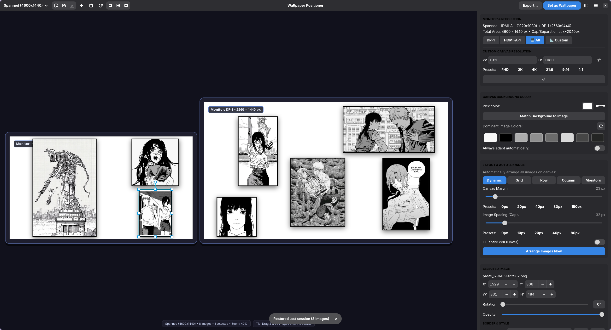
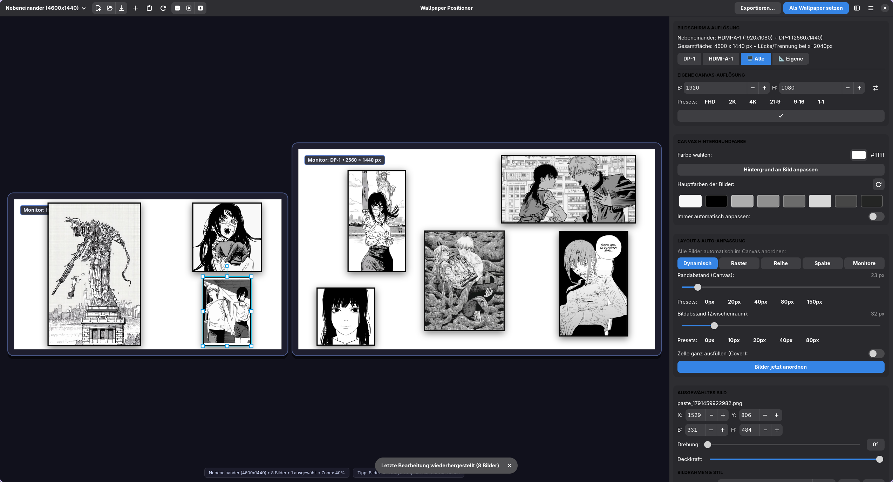

# 🎨 Wallpaper Positioner

<div align="center">



**A modern, powerful image composition and wallpaper tool for Linux (Wayland & X11).**  
*Built with Python, GTK 4, Libadwaita, and Cairo.*

[](LICENSE)
[]()
[]()

</div>

---

## 📸 Screenshots

| 🖥️ Dual-Monitor Canvas (Spanned Displays) | 🌐 Clean UI & Selected Layer Properties |
| :---: | :---: |
|  |  |

---

## 🌟 Overview

**Wallpaper Positioner** is an intuitive, graphic-editor-grade desktop utility for Linux that enables you to freely place, transform, layer, and style multiple images on an interactive high-resolution canvas. Once designed, you can export your creation as a high-fidelity image or apply it as your active desktop wallpaper across one or more monitors with a single click.

---

## ✨ Features

### 🖥️ Multi-Monitor Awareness & Spanned Displays
* **Automatic Hardware Querying:** Directly queries connected monitors, native resolutions, position offsets, and refresh rates via Hyprland IPC (`hyprctl`) with an automatic GDK4 fallback for other Wayland compositors (Sway, River, GNOME, KDE) and X11.
* **Separated Multi-Monitor Canvas:** In *Spanned* mode, displays are rendered as separate visual monitors with chassis outlines, drop shadows, and gap separation—not as one giant, distorted rectangle.
* **Coordinate Persistence:** Each image remembers which monitor it belongs to and its local relative coordinates. Switching between individual monitor views and the spanned view preserves exact image positions.
* **Per-Monitor Slicing:** When applying a multi-monitor wallpaper, the tool automatically crops and generates pixel-perfect resolution slices for each physical display.

### 📐 Custom Canvas Resolutions
* Choose between your connected physical screens or define custom canvas dimensions.
* **Built-in Presets:** Quickly switch between **FHD** (1920×1080), **2K** (2560×1440), **4K** (3840×2160), **Ultrawide 21:9** (3440×1440), **Portrait 9:16** (1080×1920), and **Square 1:1** (2000×2000).
* **Dimension Swap:** One-click orientation swap between Landscape and Portrait.

### ⚡ Dynamic Auto-Layout & Spacing Sliders
* **Dynamic Space Allocation:** Automatically arranges all images on the canvas such that larger images receive proportionally more canvas area than smaller ones.
* **4 Arrangement Modes:**
  * **Dynamic:** Proportionally weighted multi-row / column pack.
  * **Grid:** Balanced rows and columns adapted to the canvas aspect ratio.
  * **Row:** Side-by-side arrangement.
  * **Column:** Vertical stack.
  * **Monitors:** Evenly divides images across physical monitors.
* **Live Sliders:** Adjust outer canvas margins (0–300px) and intra-image spacing gaps (0–200px) with instant real-time canvas preview.
* **Fit vs. Cover:** Toggle between preserving natural aspect ratios or completely filling grid cells.

### 🖼️ Borders, Rounded Corners & 3D Drop Shadows
* **Border Frames:** Configurable border thickness (0–100px), custom color dialog, and quick presets (*White*, *Black*, *Accent*, *Gold*).
* **Corner Radius:** Smoothly round image corners and border frames from 0px up to 200px.
* **Drop Shadow Engine:** Realistic Gaussian blur shadows with adjustable blur radius, opacity, X/Y offsets, and custom colors.
* **Shadow Presets:** 1-click presets for *Subtle*, *Standard*, *Floating* (deep 3D elevation), and *Glow* (uniform halo).
* **Style Inheritance & Batch Apply:** New images automatically inherit your current styling, and the "Apply style to all images" button propagates settings across existing artwork.

### 🖱️ Multi-Selection & Group Manipulation
* **Rubberband Selection:** Click and drag anywhere on empty canvas space to draw a selection rectangle. All touched layers are immediately selected.
* **Multi-Select:** Hold `Shift` or `Ctrl` while clicking to add or remove individual layers from the selection.
* **Select All:** Press `Ctrl+A` to instantly select every image on the canvas.
* **Group Operations:** Move, rotate, change opacity, adjust borders, or delete all selected images simultaneously.

### 🎨 Color Engine & Harmonious Palettes
* **Dominant Color Extraction:** Uses k-means clustering to extract the top dominant color palette from all placed images.
* **Match Background Button:** Sets the canvas background color to harmoniously match the strongest dominant tone of your artwork.
* **Interactive Color Chips:** Click any palette swatch to instantly apply it as the canvas background.

### 📋 Clipboard Integration (`Ctrl+V`)
* Paste screenshots or copied images directly from the system clipboard using `Ctrl+V` or the header button.
* Supports raw clipboard bitmap data (e.g. from Grimblast, Hyprshot, Flameshot, or browser "Copy Image"), file lists, and local image paths.

### 💾 Project Files (`.wpp`) & Session Restore
* Save your entire layout to `.wpp` (Wallpaper Positioner Project) files.
* Stores canvas geometry, layers, transformations, borders, shadows, and background settings. Clipboard images are safely embedded to prevent missing assets.
* Automatically restores your last active session on launch.

### 🚀 Native Wayland Wallpaper Backends
Applies wallpapers directly through active Wayland desktop daemons:
* **DMS** (*DankMaterialShell*) via IPC
* **hyprpaper** via `hyprctl hyprpaper`
* **swww** via `swww img`
* **awww** via `awww img`
* **swaybg** for wlroots / Sway
* **Image Export:** Alternatively export high-resolution PNG or JPEG files anywhere on disk (`Ctrl+E`).

### 🌐 Automatic Localization (i18n)
* Automatically detects system language (`de` for German, `en` for English and other locales).
* Live language switcher available directly in the main menu (☰).

---

## ⌨️ Keyboard Shortcuts

| Action | Shortcut | Description |
| :--- | :--- | :--- |
| **Save Project** | `Ctrl+S` | Save current project (`.wpp`) |
| **Save Project As** | `Ctrl+Shift+S` | Save project under a new filename |
| **Open Project** | `Ctrl+O` | Load an existing `.wpp` project |
| **New Project** | `Ctrl+N` | Reset to a blank canvas |
| **Export Wallpaper** | `Ctrl+E` | Export high-resolution PNG or JPEG |
| **Paste from Clipboard** | `Ctrl+V` | Paste screenshot or copied image |
| **Select All Layers** | `Ctrl+A` | Select all layers on canvas |
| **Deselect All** | `Esc` | Clear selection |
| **Delete Selected** | `Del` / `Backspace` | Remove selected layers |
| **Pan Canvas** | `Middle Mouse` or `Space + Drag` | Pan the viewport |
| **Zoom Canvas** | `Scroll Wheel` or `+` / `-` / `0` | Zoom in, out, or fit view |

---

## 🚀 Installation & Running

### Dependencies
* Python 3.10+
* GTK 4 & Libadwaita (`python-gobject`, `gtk4`, `libadwaita`)
* Pillow (`python-pillow`)
* Pycairo (`python-cairo`)

#### Arch Linux / CachyOS / Manjaro:
```bash
sudo pacman -S python python-gobject gtk4 libadwaita python-pillow python-cairo
```

#### Fedora:
```bash
sudo dnf install python3 python3-gobject gtk4 libadwaita python3-pillow python3-cairo
```

#### Debian / Ubuntu (23.04+):
```bash
sudo apt install python3 python3-gi python3-gi-cairo gir1.2-gtk-4.0 gir1.2-adw-1 python3-pil python3-cairo
```

---

### Running the Application

Clone the repository:
```bash
git clone https://github.com/Papatin13/Wallpaper_Positioner.git
cd Wallpaper_Positioner
```

Run via the launcher script:
```bash
./run.sh
```

Or run directly with Python:
```bash
python3 -m wallpaper_positioner.main
```

---

## 📄 License

This project is licensed under the [MIT License](LICENSE).
